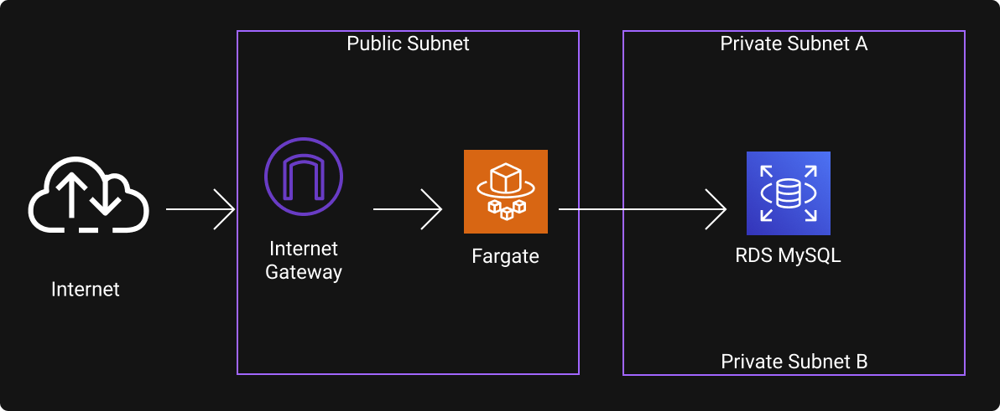

# Wordpress + MySQL on AWS ECS Fargate

### Overview

### Resources

#### Internet Gateway

This is necessary so our public subnet's resources are accessible from the internet. Just one needs to be created by VPC.

#### Route Table

In order for our public resources to be able to use the Internet Gateway, we need to tell them where to send the traffic when targetting a non local IP. We do this through a route on a route table that redirects every traffic targeted at "0.0.0.0/0" (any non local CIDR) to the Internet Gateway.

#### Public Subnet (2)

Two public subnets on distinct availability zones to receive the traffic to our Wordpress container.

#### Private Subnet (2)

RDS requires to be deployed on at least two Availability Zones, so I created two private subnets (us-east-1a and us-east-1b) for that

#### RDS (MySQL)

Along with the RDS instance, it was also necessary to create a RDS subnet group targetting to both the private subnets hosted on distinct availability zones.

#### ECS Cluster

Grouping cluster for the ECS services

#### ECS Service

An ECS Service is necessary to define how the tasks are going to be executed and how many of them. Here is where we set the launch type to be Fargate, that way we do not need to provision the EC2 instances ourselves as that is AWS managed.

### ECS Task Definition

Container settings where we define the CPU and memory, along with the container declartions like image and environment variables.
